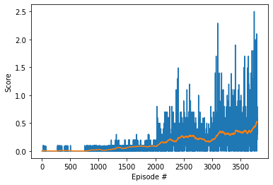
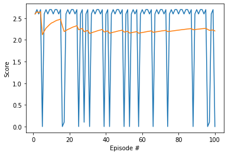

# Project 3 in Udacity Reinformcement Learning Nanodegree: 

In this project, we are working with [Tennis](https://github.com/Unity-Technologies/ml-agents/blob/master/docs/Learning-Environment-Examples.md#tennis) environment.

## Introduction

In this environment, two agents control rackets to bounce a ball over a net. If an agent hits the ball over the net, it receives a reward of +0.1. If an agent lets a ball hit the ground or hits the ball out of bounds, it receives a reward of -0.01. Thus, the goal of each agent is to keep the ball in play.

The observation space consists of 8 variables corresponding to the position and velocity of the ball and racket. Each agent receives its own, local observation. Two continuous actions are available, corresponding to movement toward (or away from) the net, and jumping.

The task is episodic, and to solve the environment, the agents must get an average score of +0.5 over 100 consecutive episodes.
In each episode, we add up the rewards for each agent and get a final score for each agent. This yields 2 scores, maximum of which will be consider as the result of the episode. The environment is considered solved, when the average over 100 episodes is at least +0.5.

## Solution method

Multi Agent Deep Deterministic Policy Gradient is used to solve this environment. Each agent has two neural networks, one as actor and one as critic. The actor network has the state vector as input and action vector as output. Critic network has both state vector and action vector as inputs and estimates the reward. The networks used for the agents are exactly the ones used in [Project 2 Continuous Control](https://github.com/SaidZahrai/deepRL-P2-Continuous_Control) with the inputs and outputs adjusted to the current environment. The input of the actor network is the state vector with 24 states and the output will be two actions. The critic network has the state vector as input and at the second layer, the two actions are added. The output of the critic network is one value.

```Python
Actor network:  Actor(
  (fc1): Linear(in_features=24, out_features=128, bias=True)
  (fc2): Linear(in_features=128, out_features=128, bias=True)
  (fc3): Linear(in_features=128, out_features=2, bias=True)
)
Critic network:  Critic(
  (fcs1): Linear(in_features=24, out_features=128, bias=True)
  (fc2): Linear(in_features=130, out_features=128, bias=True)
  (fc3): Linear(in_features=128, out_features=1, bias=True)
)
```

Six different cases are studied. The code for these cases is very similar and only small changes are made between them. However, to make it simple to go through the solution procedure, all the code is put in a notebook; as a result, there are 6 different notebooks in the repository. 

The implementation and test of the method are presented in this repository, with the files organized as follows:

1. `Tennis_SimpleMemory.ipynb` solves the environment with two separate agents.
2. `Tennis_SimpleSharedMemory.ipynb` solves the environment with two agents that share memory.
3. `Tennis_PrioritizedExperienceReplay.ipynb`solves the environment with two agents, with prioritized experience replay.
4. `Tennis_PrioritizedExperienceReplayShared.ipynb` solves the environment with two agents, with prioritized experience replay, when they share memory.
5. `Tennis_SelectiveMemory.ipynb` solves the environment with two separate agents, where the memory is selective and requires 1% of good shots.
6. `Tennis_SimpleMemorySingleAgent.ipynb` solves the environment with one single agent.

## Getting Started

### 1. Setting up the Python environment

If you have the environment set up ready for the first project, [Navigation](https://github.com/udacity/deep-reinforcement-learning/tree/master/p1_navigation), you should be good to go. Otherwise, you need to install the required libraries and packages. A suggesiton would be to use Anaconda. If you do not have it, you can install it from [here](https://www.anaconda.com/products/individual) and then folloe the steps below:

```
conda create --name unity python=3.6
conda activate unity

pip install unityagents
pip install mlagents
pip install gym
pip install h5py
pip install Pillow
```

### 2. Downloading the Unity environment

As mentioned, in this project, I chose the second option, with 20 agents. To run the code in this positoy, you need to have the 2nd version with 20 robots. From the list below, choose the right version for your operative system:

- [Linux](https://s3-us-west-1.amazonaws.com/udacity-drlnd/P3/Tennis/Tennis_Linux.zip)
- [Mac OSX](https://s3-us-west-1.amazonaws.com/udacity-drlnd/P3/Tennis/Tennis.app.zip)
- [Windows (32-bit)](https://s3-us-west-1.amazonaws.com/udacity-drlnd/P3/Tennis/Tennis_Windows_x86.zip)
- [Windows (64-bit)](https://s3-us-west-1.amazonaws.com/udacity-drlnd/P3/Tennis/Tennis_Windows_x86_64.zip)

If you are on Windows and are not sure which version you have, you can check [this link](https://support.microsoft.com/en-us/help/827218/how-to-determine-whether-a-computer-is-running-a-32-bit-version-or-64).

Note that the code in this repository has been tested on a 64-bit Windows.

## Solving the environment

### 1. Training the agent

To run the program, you simply start jupyter and open one of the notebooks and run all cells. The first cell with code contains

```
what_to_do = '' # set it to 'train' or 'test'
what_to_do = 'test'
what_to_do = 'train'
``` 

by setting the variable `what_to_do` to 'train' or 'test' you choose what to do. If you choose to train, the graphics will be turned off to make the process faster.

Every 100 episodes the results are stored in 4 files with the names
1. `xyz_maddpg_1_checkpoint_actor.pth`
2. `xyz_maddpg_2_checkpoint_actor.pth`
3. `xyz_maddpg_1_checkpoint_critic.pth`
4. `xyz_maddpg_2_checkpoint_critic.pth`

where `xyz` will show which case it concerns about.

Once the environment is solved, the result is presented as a graph that shows the scores at each episode and the average over 100 episodes. The figure below shows a typical output if you train the agents:

<figure class="image" style="display:inline-block">
    <center> Training with noise added to actions </center>
  
</figure>


### 2. Testing the agent

If you choose to test in the first cell, you will have typically such an output:
<figure class="image" style="display:inline-block">
    <center> Test without noise </center>
  
</figure>

### 3. Changing the hyper parameters

If you wish to make changes in the hyper parameters, there are two areas to visit. Close to the end of the notebook, you set the configuration parameters before you create the agent:

```Python
AgentConfig={"state_size": state_size, 
             "action_size": action_size, 
             "lr_actor": 1e-3,         # learning rate of the actor
             "lr_critic": 1e-3,        # learning rate of the critic 
             "batch_size": 512,        # minibatch size
             "buffer_size": int(1e5),  # replay buffer size 
             "gamma": 0.99,            # discount factor
             "noise_decay": 1,         # Noise decay rate - Added, but not used
             "tau": 1e-3,              # for soft update of target parameters
             "random_seed": 13,        # Random Seed
             "learn_every": 2,        # frequency of learning
             "device": torch.device("cuda:0" if torch.cuda.is_available() else "cpu")}
```

If you want to change the size or the structure of the networks, you can do it in the constructor of Actor or Credic classes:

```Python
class Actor(nn.Module):
    """
        Actor (Policy) Model. A simple 2 layer fully connected network.
    
    """

    def __init__(self, state_size, action_size, seed, fc1_units=128, fc2_units=128):
        """Initialize parameters and build model.
        Params
        ======
            state_size (int): Dimension of each state
            action_size (int): Dimension of each action
            seed (int): Random seed
            fc1_units (int): Number of nodes in first hidden layer
            fc2_units (int): Number of nodes in second hidden layer
        """
        super(Actor, self).__init__()
        self.seed = torch.manual_seed(seed)
        self.fc1 = nn.Linear(state_size, fc1_units)
        self.fc2 = nn.Linear(fc1_units, fc2_units)
        self.fc3 = nn.Linear(fc2_units, action_size)
        self.reset_parameters()


class Critic(nn.Module):
    """
        Critic (Value) Model. The input is both the current state and the actions.
        State gors through a first layer and then will be concatenated with the action
        before going through the output layer to estimate the corresponding value.
        
    """

    def __init__(self, state_size, action_size, seed, fcs1_units=128, fc2_units=128):
        """Initialize parameters and build model.
        Params
        ======
            state_size (int): Dimension of each state
            action_size (int): Dimension of each action
            seed (int): Random seed
            fcs1_units (int): Number of nodes in the first hidden layer
            fc2_units (int): Number of nodes in the second hidden layer
        """
        super(Critic, self).__init__()
        self.seed = torch.manual_seed(seed)
        self.fcs1 = nn.Linear(state_size, fcs1_units)
        self.fc2 = nn.Linear(fcs1_units+action_size, fc2_units)
        self.fc3 = nn.Linear(fc2_units, 1)
        self.reset_parameters()


```
or in the constructor DDPGAgent

```Python
class DDGPAgent():
    """Interacts with and learns from the environment."""
    
    def __init__(self, agent_config, random_seed, memory):

        ....        
        ....        
        ....        
        ....        

        # Actor Network (w/ Target Network)
        self.actor_local = Actor(self.state_size, self.action_size, random_seed).to(self.device)
        self.actor_target = Actor(self.state_size, action_size, random_seed*2).to(self.device)
        self.actor_optimizer = optim.Adam(self.actor_local.parameters(), lr=self.lr_actor)

        # Critic Network (w/ Target Network)
        self.critic_local  = Critic(state_size, action_size, random_seed*3).to(self.device)
        self.critic_target = Critic(state_size, action_size, random_seed*4).to(self.device)
        self.critic_optimizer = optim.Adam(self.critic_local.parameters(), lr=self.lr_critic)
```

